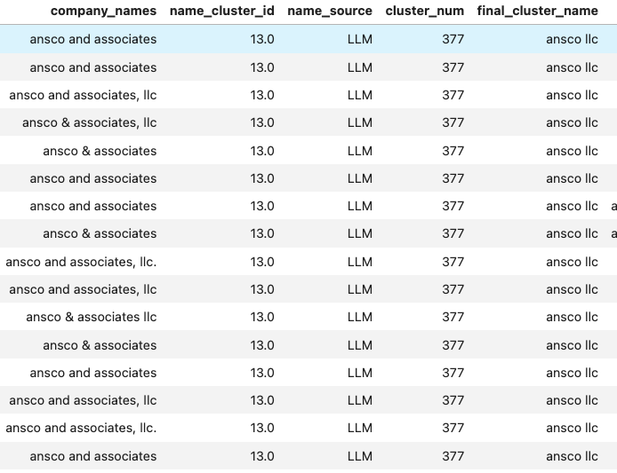
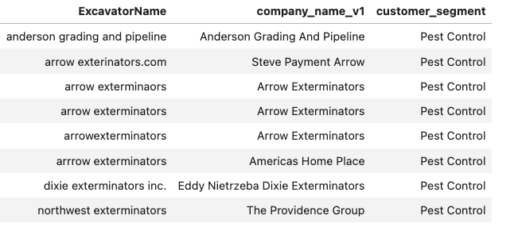

# When One Company Appears Under Ten Different Names

Company names often look like clean identifiers in a database.

In reality, they rarely are.

In one 811 organization's historical ticket data, contractor names were entered as free-form text. The same company could therefore appear under several variations:

- GA Power
- GA Power Co.
- GA Power Company

Other differences came from punctuation, abbreviations, spelling mistakes, legal suffixes, or inconsistent spacing.

To a person, these clearly look like the same organization. To a database, they are separate entities.

<!-- more -->

## Why this mattered

The organization wanted to better understand the contractors operating in its service area, including their ticket activity and damage risk.

However, when one company was spread across several names, its history was fragmented.

This created two major limitations.

First, it was difficult to calculate risk at the company level. A contractor might appear relatively low-risk under each individual name, even though its combined history told a different story.

Second, the organization could not easily manage its contractor portfolio. Without consistent company identities, it was harder to:

- understand which contractors or industries generated the most activity;
- identify companies with elevated risk;
- compare similar contractor groups;
- send targeted safety or educational material.

Before building more advanced risk models, we first needed a reliable way to determine which names referred to the same company.

## Turning company names into clusters

The dataset contained approximately 60,000 company-name records, making manual review impractical.

The solution used several steps:

1. Convert each company name into a numerical embedding representing its meaning and structure.
2. Use FAISS to quickly find the most similar names for each record.
3. Connect names whose cosine similarity exceeded a strict threshold.
4. Treat connected names as candidate company clusters.
5. Re-cluster larger groups to separate companies that looked similar but were actually different.
6. Flag uncertain cases for manual review.

The initial graph-based process produced more than 2,500 candidate clusters. A later refinement stage produced approximately 2,345 company-name groups.



For example:

```text
GA Power
GA Power Co.
GA Power Company
        ↓
     GA Power
```

The same approach grouped variations such as:

```text
Wilhoit Gas Inc.
Wilhoit Gas Co Inc.
Wilhoit Gas Company Inc.
Wilhoit Gas Company
```

These records could then be treated as one organization rather than four unrelated contractors.

## Why a simple fuzzy match was not enough

The difficult part was not identifying obvious formatting differences.

The difficult part was avoiding false matches.

For example, two companies may both contain words such as "plumbing," "construction," or "tree service" while being completely unrelated businesses.

An early cluster labelled "Plumbing Experts" contained many separate plumbing companies. This showed why a broad similarity group could not automatically be treated as a single company.

The second clustering stage therefore divided large groups into smaller, tighter subclusters and marked uncertain records as noise for review.

This made the output more useful as a decision-support tool rather than pretending that every automated match was correct.



## What became possible

Once the historical names were connected to consistent company entities, the organization could aggregate ticket history at the correct level.

This created a foundation for:

- calculating contractor-level risk;
- finding companies with unusually high damage rates;
- tracking risk trends over time;
- comparing contractors within the same industry;
- organizing the contractor portfolio;
- targeting safety communication toward relevant companies or industries.

The clustering itself was not the final business outcome.

It was the missing data layer that made reliable company-level analysis possible.

## The broader lesson

Organizations often want to begin with prediction, risk scoring, or dashboards.

But those systems depend on knowing what each record represents.

When entity names are inconsistent, even a sophisticated model can produce misleading results because the history of one organization is scattered across multiple identities.

Sometimes the most valuable data-science work is not building a more advanced model.

It is first making sure that one company is actually represented as one company.
