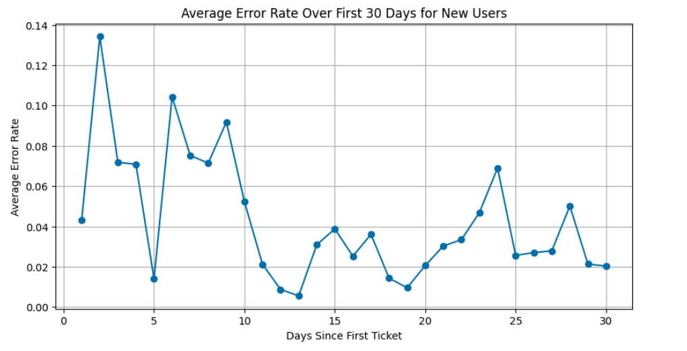
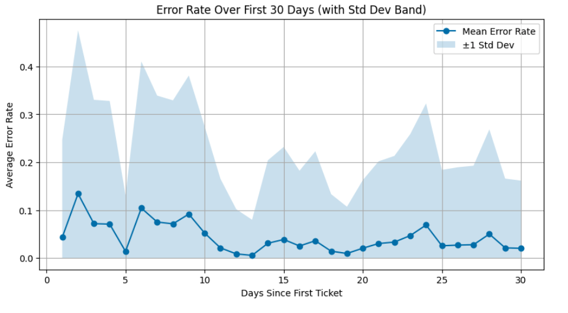

# How a Simple Data Analysis Reduced Unnecessary Audit Work

Not every useful data project needs a complex model.

Sometimes, a simple analysis can reveal that an existing business rule is creating unnecessary work.

A utility notification organization had a policy of auditing every ticket submitted by a new user for their first 30 days.

The reasoning was straightforward: new users were expected to make more mistakes while learning the system.

But the 30-day threshold was based on a heuristic rather than data.

Since audit capacity was limited, we wanted to answer a simple question:

> Do new users really need to be audited for the full 30 days?

<!-- more -->

## How quickly do new users improve?

We analyzed the average ticket error rate during the first 30 days after a user submitted their first ticket.

The error rate declined quickly during the first part of the month.

A simple linear trend estimated that the error rate decreased by around 0.18 percentage points per day. By Day 30, the average error rate was approximately 3%.

However, most of the improvement happened much earlier.

The largest decline occurred during roughly the first 10 to 12 days. After that, the error rate began to stabilize.

## Was 30 days too long?

To test the policy more directly, we compared the error rate on each day with the error rate observed on Day 30.

During the first 10 days, error rates were generally still higher than the Day 30 baseline.

Between Days 11 and 15, the results were mixed.

After Day 15, most daily error rates were no longer meaningfully different from Day 30.

This suggested that the full 30-day audit period was longer than necessary.

## Recommendation

Based on the analysis, we recommended shortening the default full-audit period from 30 days to approximately 15 days.

After Day 15, users could move to spot checks unless their individual error rate remained elevated.

A stronger long-term policy would be performance-based rather than time-based. For example, a user could leave full auditing after maintaining an acceptable error rate across a minimum number of tickets.

## Business impact

This was a small analysis, but it supported a useful operational decision.

Reducing the default audit window from 30 days to 15 days could remove a significant amount of unnecessary review work.

That capacity could then be redirected toward users and tickets with a higher likelihood of errors.

The outcome was not a complex machine learning system. It was a clearer rule, less wasted effort, and better use of a limited human-review resource.
