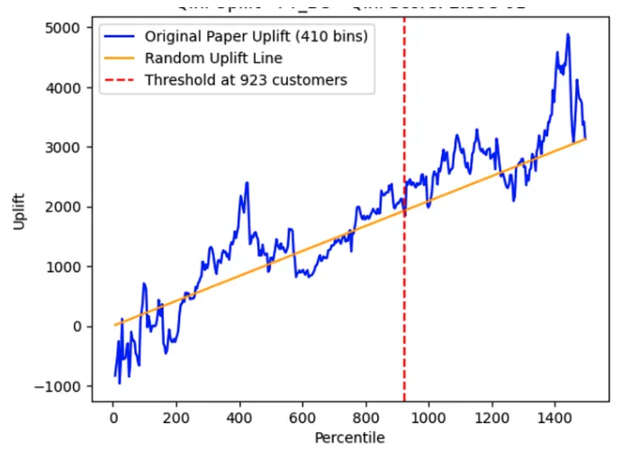

# Causal Inference for Coupon Targeting

!!! abstract "Case Study Summary"
    **Role**: Data Scientist / AI Engineer

    **Impact Metrics**:

    - Reframed the business question from "who will churn?" to "who will stay because we gave them a coupon?"
    - Estimated Conditional Average Treatment Effects (CATE) to rank customers by incremental benefit
    - Enabled reduced coupon spend while maximizing incremental retention over blanket distribution

A company wanted to increase customer retention by offering compensation coupons after service issues.

## Challenge

The challenge was deciding which customers should actually receive a coupon.

Simply identifying customers who were likely to churn was not enough. Some customers would remain loyal without intervention, while others might leave regardless of receiving a coupon. Sending coupons indiscriminately increased marketing costs without necessarily improving retention.

The objective was to estimate the causal impact of offering a coupon and identify customers who were most likely to change their behavior because of the intervention.

## Approach

Rather than building a predictive churn model, the project framed the problem as an uplift modeling / causal inference task.

The workflow included:

- Defining treatment and control populations.
- Identifying potential confounding variables.
- Estimating treatment effects using causal inference techniques.
- Estimating Conditional Average Treatment Effects (CATE).
- Ranking customers by expected incremental benefit from receiving a coupon.
- Comparing treatment policies against blanket coupon distribution.

This shifted the business question from "Who will churn?" to "Who will stay because we gave them a coupon?"

## Results & Business Impact

The analysis demonstrated that customer response to coupons was highly heterogeneous.

Instead of treating every dissatisfied customer equally, the framework estimated the incremental value of intervention for each customer.

The resulting prioritization strategy allows businesses to:

- Reduce unnecessary coupon costs.
- Maximize incremental retention.
- Target customers with the highest expected treatment effect.
- Separate prediction from causal decision-making.

The framework also provides a foundation for future experimentation and policy optimization.

## Visuals

*Qini curve*

-   :material-coffee:{ .lg .middle } Let's have a virtual coffee together!

    ---
    
    Want to see if we're a match? Let's have a chat and find out. Schedule a free 30-minute strategy session to discuss your AI challenges and explore how we can work together.

    [Book Free Intro Call :material-arrow-top-right:](https://calendly.com/lindsey-lindseypeng/30min){ .md-button .md-button--primary }

