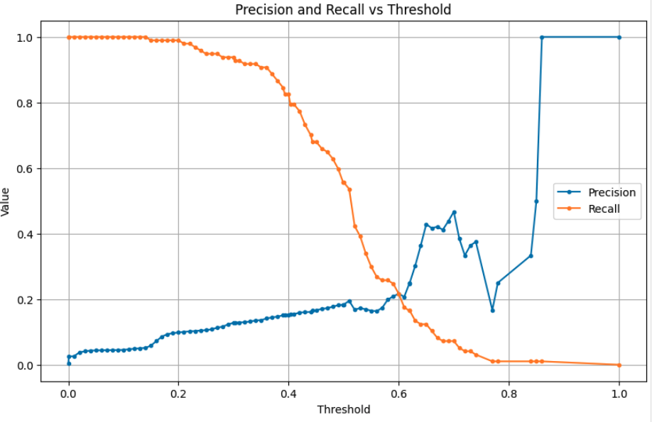
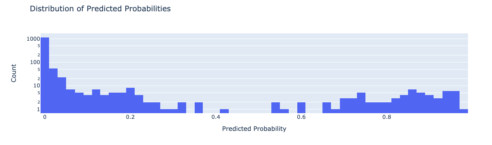
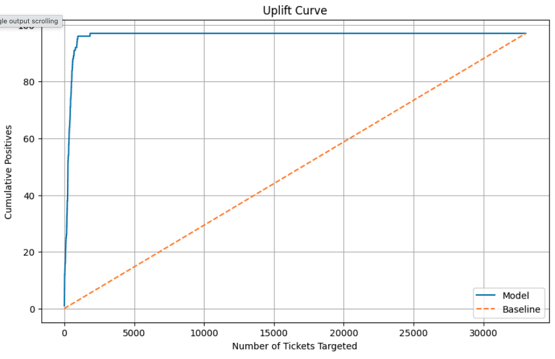

# AI-Assisted Risk Scoring for Operational Ticket Auditing

!!! abstract "Case Study Summary"
    **Industry**: Logistics  
    **Role**: Data Scientist / AI Engineer

    **Impact Metrics**:

    - Evaluated over 94,000 operational tickets
    - ~13% precision with ML-assisted review vs. ~3% under random sampling
    - ~4x increase in error discovery efficiency at the same review budget
    - Identified hundreds of critical operational errors in production

A logistics company processes tens of thousands of operational tickets every month. Only a very small fraction contain critical data quality issues (approximately 3% of reviewed tickets), making manual auditing both expensive and inefficient.

## Challenge

The objective was not simply to build a binary classifier, but to prioritize the highest-risk tickets so that a limited team of human reviewers could uncover significantly more errors without increasing review capacity.

## Our Approach

Developed a machine learning risk scoring model that ranks tickets by their probability of containing operational errors.

Instead of optimizing solely for traditional machine learning metrics (accuracy or F1 score), the evaluation focused on operational efficiency:

- Predicted a continuous risk score for every ticket.
- Ranked tickets from highest to lowest risk.
- Selected review candidates using configurable risk thresholds.
- Compared model-assisted review against random sampling to measure improvements in human review efficiency.
- Analysed precision, recall, review workload, and threshold trade-offs to identify the optimal operating point.
- Evaluated deterministic business rules alongside the ML model to identify rule-based false positives and opportunities for refinement.

A key design consideration was treating the model as a decision-support ranking system rather than a traditional classifier. This allowed operational teams to dynamically adjust review thresholds depending on available reviewer capacity.

## Results & Impact

- Evaluated over 94,000 operational tickets.
- Human-reviewed approximately 33,000 tickets.
- ML-assisted review achieved approximately 13% precision, compared with a 3% error rate under random sampling.
- Increased error discovery efficiency by approximately 4x compared to random review while maintaining the same review budget.
- Identified hundreds of critical operational errors during production deployment.
- Determined the production threshold (0.20) closely matched the peak error density, validating the chosen operating point.
- Identified opportunities to further improve performance by refining deterministic business rules that generated avoidable false positives.

## Visuals

*Precision vs. threshold plot*

*Error distribution by prediction score*

*Confusion matrix*

*Lift / uplift curve*

-   :material-coffee:{ .lg .middle } Let's have a virtual coffee together!

    ---
    
    Want to see if we're a match? Let's have a chat and find out. Schedule a free 30-minute strategy session to discuss your AI challenges and explore how we can work together.

    [Book Free Intro Call :material-arrow-top-right:](https://calendly.com/lindsey-lindseypeng/30min){ .md-button .md-button--primary }

